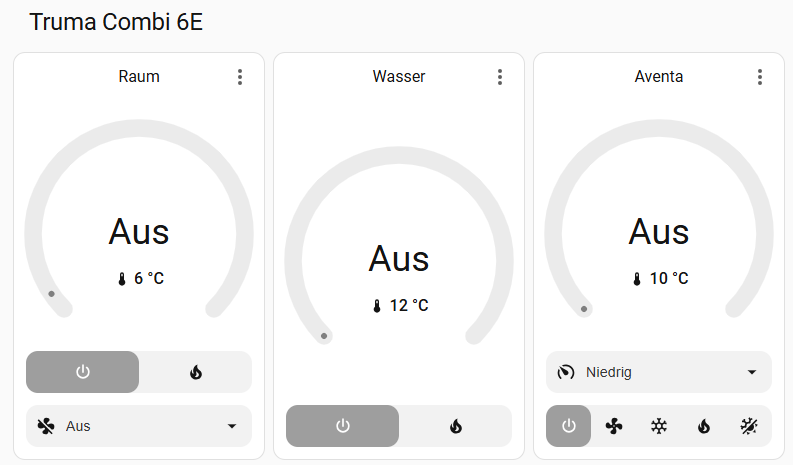

<div align="center">

# ESPHOME-TRUMA AND MORE


[](https://github.com/havanti/esphome-truma/releases) [](https://github.com/havanti/esphome-truma) [](https://esphome.io) [](LICENSE)

[Funktionen](#was-dieser-fork-ergänzt) • [Beispiele](#beispielkonfigurationen) • [Hardware](hardware/) • [Entkokung](#diesel-entkokung-bzw-rückstandsverbrennung) • [Aventa AC](#truma-aventa-gen-2--klimaanlage) • [Cooler](#truma-cooler-cxx--kühlbox) • [TPMS](#tpms--reifendrucküberwachung-via-bluetooth-proxy) • [Contributing](CONTRIBUTING.md)

🇩🇪 Deutsch | [🇬🇧 English](README.en.md)

*Beiträge willkommen — bitte zuerst ein [Issue öffnen](../../issues), bevor du einen PR erstellst. Siehe [CONTRIBUTING.md](CONTRIBUTING.md).*

</div>

## Schnellstart

1. **Hardware** → [Verdrahtung & Teileliste](hardware/README.md)
2. **Variante wählen** → passende YAML aus der [Tabelle unten](#beispielkonfigurationen) (Gas/Diesel × ESP32/ESP32-S3)
3. **`secrets.yaml` anlegen** → [Vorlage](#voraussetzungen)
4. **Flashen** → `esphome run <config>.yaml`

Minimalbeispiel für den schnellen Einstieg → [direkt hier](#minimalbeispiel)

---

## Danksagungen

Ein herzliches Dankeschön gilt **[Fabian Schmidt](https://github.com/Fabian-Schmidt)**, dessen herausragende Arbeit am originalen [esphome-truma_inetbox](https://github.com/Fabian-Schmidt/esphome-truma_inetbox)-Repository überhaupt erst alles möglich gemacht hat. Dieses Projekt ist ein Fork seiner Arbeit, und ohne sein Engagement und seine Fachkenntnis wäre nichts davon entstanden. Danke, Fabian!

Dieses Projekt baut außerdem auf der Vorarbeit des [WomoLIN-Projekts](https://github.com/muccc/WomoLIN) und [Daniel Fetts inetbox.py](https://github.com/danielfett/inetbox.py) sowie [mc0110s inetbox2mqtt](https://github.com/mc0110/inetbox2mqtt) auf — ihre Protokollforschung, Log-Dateien und Dokumentation waren von unschätzbarem Wert.

---

## Was dieser Fork ergänzt

Dieser Fork erweitert die ursprüngliche Komponente um mehrere praxiserprobte Funktionen, die im täglichen Betrieb in einem Wohnmobil mit einer Truma Combi 6DE und einem ESP32-S3-Board entwickelt wurden. Die vollständige, funktionsfähige Konfiguration findet sich in [`ESP32-S3_truma_6DE_Diesel_example.yaml`](ESP32-S3_truma_6DE_Diesel_example.yaml).

### Diesel-„Entkokung" bzw. Rückstandsverbrennung

Wenn eine Truma Combi längere Zeit mit Diesel betrieben wird, können sich Rußablagerungen am bzw. im Brennervlies (Edelstahlsintermaterial) und am Glühstiftsieb ansammeln. Empfohlene Pflegemaßnahmen:

- Monatlichen Entkokungszyklus durchführen (durch diese Konfiguration automatisiert, siehe unten).
- Möglichst hochwertigen Dieselkraftstoff verwenden oder einen cetanzahlerhöhenden Kraftstoffzusatz in den Tank geben — eine höhere Cetanzahl führt zu saubererer Verbrennung und reduziert Ablagerungen.

Das integrierte `script_diesel_decoking` automatisiert diesen Vorgang:

1. Schaltet den Energiemix auf Diesel
2. Stellt die Raumheizung für 45 Minuten auf 30 °C / HIGH-Modus ein
3. Schaltet das Heizgerät anschließend ab
4. Nach dem Abschalten startet die Truma Combi automatisch einen Nachglühvorgang des Glühstifts, um eventuelle Rückstände am Glühstiftsieb zu verglühen — dies geschieht unabhängig von der Entkokungsfunktion und ist ein normaler Bestandteil des internen Truma-Abschaltvorgangs
5. (Türen und Fenster öffnen ;-) )

In Home Assistant werden zwei Schaltflächen bereitgestellt:

| Schaltfläche | Funktion |
|---|---|
| Start Diesel De-coking | Startet den 45-minütigen Entkokungszyklus |
| Abort Diesel De-coking | Bricht den Zyklus ab und schaltet das Heizgerät aus |

Ein Template-Sensor (Diesel De-coking Remaining Time, Einheit: min) zeigt die verbleibende Zeit an und ist im Home-Assistant-Dashboard sowie in der integrierten Web-UI sichtbar.

### Truma Aventa Gen 2 — Klimaanlage



Der ESP32 steuert die Truma Aventa Gen 2 Klimaanlage über denselben LIN-Bus wie die Heizung — kein zweites Gerät nötig. In Home Assistant erscheint eine vollständige Climate-Entität mit allen Betriebsmodi.

Unterstützte Modi:

| HA-Modus | Aventa-Funktion |
|---|---|
| Off | Klimaanlage aus |
| Cool | Kühlen |
| Heat | Heizen |
| Heat/Cool | Automatik (Heizen + Kühlen) |
| Fan only | Nur Lüfter |

Lüftergeschwindigkeiten: Low / Mid / High / Night / Auto

Temperaturbereich: 16–31 °C, Schrittweite 1 °C

Beispielkonfiguration: [`ESP32-S3_truma_Aventa_example.yaml`](ESP32-S3_truma_Aventa_example.yaml)

### Truma Cooler C(XX) — Kühlbox

Der Truma Cooler C(XX) wird über BLE direkt gesteuert — kein separates Gateway nötig. Die Komponente `truma_cooler` liegt parallel zu den anderen Komponenten in `components/` dieses Repos:

```yaml
external_components:
  - source:
      type: git
      url: https://github.com/havanti/esphome-truma
      ref: main
    components: [truma_cooler]
    refresh: 24h
```

> **Hinweis:** Das Protokoll wurde ausschließlich am C44 reverse-engineered. Rückmeldungen zu anderen Modellen sind willkommen — bitte ein [Issue](../../issues) öffnen.

#### Features

- **Klimasteuerung** — Ein/Aus und Solltemperatur (−22 °C bis +10 °C) direkt aus Home Assistant oder dem integrierten Web-Portal
- **Turbo-Schalter** — Turbo-Modus ein/ausschalten (Gerät muss eingeschaltet sein); wird beim Einschalten automatisch zurückgesetzt
- **Innentemperatur** — gemessene Temperatur im Inneren der Kühlbox (mit Glättungsfilter)
- **Kompressor-Status** — Anzeige ob der Kompressor gerade läuft
- **Gerätestatus** — Anzeige ob die Kühlbox eingeschaltet ist
- **BLE-Verbindungsstatus** — Anzeige der aktuellen BLE-Verbindung zum ESP
- **OTA-Update** — kabellose Firmware-Updates direkt über WLAN
- **Web-Portal** — lokale Oberfläche auf Port 80 (ESPHome Web Server v3), kein Home Assistant erforderlich
- **ESP-Neustart** — Schaltfläche zum Neustarten des ESP aus Home Assistant

#### Voraussetzungen

- **Mikrocontroller** mit BLE — empfohlen: [ESP32-S3 DevKitC-1](https://docs.espressif.com/projects/esp-idf/en/latest/esp32s3/hw-reference/esp32s3/user-guide-devkitc-1.html)
- **Framework**: ESP-IDF (zwingend für BLE Secure Connections / Bonding — Arduino nicht unterstützt)
- **ESPHome** ≥ 2026.4.3
- **MAC-Adresse** der Kühlbox — einmalig via [nRF Connect](https://www.nordicsemi.com/Products/Development-tools/nRF-Connect-for-mobile) oder Truma App (aus App danach entfernen: nur eine BT-Verbindung möglich)

> **Empfehlung:** Wer ausschließlich den Truma Cooler ohne Heizung oder Klimaanlage betreibt, kann einen **M5Stack Atom Lite** als dedizierten ESP32 nutzen. Das Gerät ist kompakt, günstig und unterstützt ESP-IDF — ideal als eigenständiger BLE-Knoten nur für die Kühlbox. Der M5Stack Atom eignet sich gleichzeitig hervorragend als [ESPHome Bluetooth Proxy](https://esphome.io/components/bluetooth_proxy.html), sodass weitere BLE-Geräte über Home Assistant erreichbar werden — ohne zusätzliche Hardware.

Eine vollständige Beispielkonfiguration findet sich in [`ESP32_truma_cooler_example.yaml`](ESP32_truma_cooler_example.yaml).

### TPMS — Reifendrucküberwachung via Bluetooth Proxy

Der ESP32 fungiert gleichzeitig als Bluetooth Low Energy (BLE)-Empfänger für handelsübliche TPMS-Sensoren und macht ein separates Gateway überflüssig. Vier Sensoren werden gleichzeitig überwacht (FL, FR, RR, RL), jeder meldet:

- Reifendruck in bar
- Reifentemperatur in °C
- Sensorakku-Spannung in V

Die Integration nutzt `esp32_ble_tracker` mit passivem Scanning und wertet die herstellerspezifischen BLE-Advertisement-Nutzdaten direkt in einem C++-Lambda aus. Alle zwölf Sensor-Entitäten erscheinen automatisch in Home Assistant als Diagnose-Sensoren.

Um dies für eigene Sensoren anzupassen, sind die vier MAC-Adressen in den `on_ble_advertise`-Blöcken durch die eigenen TPMS-Sensor-Adressen zu ersetzen. Die Dekodierungslogik (Druckoffset, Skalierung) muss je nach Sensormarke gegebenenfalls angepasst werden.

> Hinweis: BLE-Scanning und der Truma-LIN-Bus laufen parallel auf demselben Chip. Auf einem ESP32-S3 mit OctalSPI-PSRAM kann der BLE-Stack in den PSRAM ausgelagert werden, was das Risiko von Speicherkonflikten erheblich reduziert. Die mitgelieferten PSRAM-`sdkconfig_options` in `ESP32-S3_truma_6DE_Diesel_example.yaml` sind bereits entsprechend konfiguriert.

> **Modulare TPMS-Variante:** [@kamahat](https://github.com/kamahat) hat die TPMS-Logik in eine eigenständige `tpms.yaml` + C++-Hilfsfunktion ausgelagert. Wer eine sauber getrennte Paketstruktur bevorzugt, findet diese Variante in seinem [Fork](https://github.com/kamahat/esphome-truma).

Beispielkonfiguration: [`ESP32-S3_truma_6DE_Diesel_example.yaml`](ESP32-S3_truma_6DE_Diesel_example.yaml)

### Onboard RGB-LED — visuelle Statusanzeige (ESP32-S3)

Das [Waveshare ESP32-S3-DEV-KIT-N8R8](https://www.waveshare.com/wiki/ESP32-S3-DEV-KIT-N8R8) und viele weitere ESP32-S3-Entwicklerboards verfügen über eine integrierte WS2812-RGB-LED (GPIO38), die ohne zusätzliche Hardware als visuelle Statusanzeige für den LIN-Bus genutzt werden kann.

Die Beispielkonfiguration nutzt diese LED mit zwei Signalen:

| Signal | Bedeutung |
|---|---|
| Grün blinkt (alle 2 s, 500 ms) | CP Plus verbunden — LIN-Bus aktiv |
| Blau blitzt (300 ms) | TX-Kommando an Heizung gesendet |
| Aus | CP Plus nicht verbunden |

**Vorteile gegenüber einer reinen Home-Assistant-Anzeige:**

- Sofortige visuelle Rückmeldung direkt am Gerät, ohne App oder Dashboard
- Erkennbar ob der ESP überhaupt kommuniziert, bevor WiFi oder HA verfügbar ist
- Hilfreich bei der Erstinbetriebnahme und Fehlersuche vor Ort

**Hinweis zum 90-Sekunden-Timeout:** Der `CP_PLUS_CONNECTED`-Sensor meldet `false` erst 90 Sekunden nach dem letzten empfangenen LIN-Paket. Wird das CP Plus physisch getrennt, bleibt die LED daher noch bis zu 90 Sekunden grün — das ist das designierte Verhalten des LIN-Bus-Protokolls, das kurze Verbindungsunterbrechungen tolerieren soll.

Die Implementierung verwendet zwei ESPHome-Globals (`led_color`, `led_ticks`) und ein 100-ms-Intervall als LED-Treiber, sodass andere Intervalle (Alive-Anzeige) und Switch-Aktionen (TX-Kommandos) die LED durch einfaches Setzen dieser Variablen ansteuern können.

### Feinabstimmung, Überwachung & Stabilität

Die Beispielkonfiguration enthält eine Reihe produktionserprobter Einstellungen, die im Basisbeispiel nicht enthalten sind:

WiFi-Ausfallsicherheit — Ein 5-Minuten-Intervall prüft auf unterbrochene Verbindung und führt einen Soft-Reconnect durch (`wifi.disable` → Verzögerung → `wifi.enable`), ohne den ESP neu zu starten. `reboot_timeout` ist auf `0s` gesetzt, um unerwartete Neustarts während Heizzyklen zu verhindern.

WiFi-HF-Optimierung — Die Sendeleistung ist auf `17 dB` festgelegt und der Energiesparmodus auf `light` gesetzt, für eine zuverlässige Verbindung in einem Metallfahrzeugkörper.

Systemdiagnose — Folgende Sensoren sind in Home Assistant immer verfügbar:

| Sensor | Beschreibung |
|---|---|
| TR ESP32 Temperature | Interne Chip-Temperatur |
| TR WiFi Signal dB | Roh-RSSI in dBm (alle 60 s aktualisiert) |
| TR WiFi Signal | RSSI auf 0–100 % abgebildet für einfaches Dashboarding |
| Uptime Sensor | Zeit seit dem letzten Neustart |

Home-Assistant-Zeitsynchronisation — Die ESP-Uhr wird über die Home-Assistant-Zeitplattform synchron gehalten, was für das korrekte Funktionieren der Timer-Aktionen erforderlich ist.

Integrierte Web-UI — Ein lokaler Webserver läuft auf Port 80 (ESPHome Web Server v3) mit `include_internal: true`, sodass alle Entitäten einschließlich interner Diagnosedaten direkt im Browser sichtbar sind, ohne Home Assistant zu benötigen.

Template-Schalter — Fertige Ein/Aus-Schalter für die Raumheizung, den Wasserboiler und den integrierten Timer sind enthalten, was die Automatisierung und Dashboard-Integration vereinfacht.

Neustart-Schaltfläche — Eine Ein-Klick-ESP-Neustart-Schaltfläche ist in Home Assistant für die Fernwartung verfügbar.

---

## Beispielkonfigurationen

Dieses Repository stellt vier gebrauchsfertige Beispielkonfigurationen für die Truma Combi-Heizgerätefamilie bereit.
Alle verwenden das ESP-IDF-Framework und beziehen die Komponente direkt aus diesem Repository.
Erfordert ESPHome >= 2026.4.3.

**Unterstützte Modelle:**

| Modell          | Leistung        | Brennstoff         | Elektro (230 V) |
| --------------- | --------------- | ------------------ | --------------- |
| Combi 4         | ~4 kW           | Gas (Propan/Butan) | ❌              |
| Combi 6         | ~6 kW           | Gas (Propan/Butan) | ❌              |
| Combi 4E        | ~4 kW (+Hybrid) | Gas                | ✅              |
| Combi 6E        | ~6 kW (+Hybrid) | Gas                | ✅              |
| Combi Diesel 4  | ~4 kW           | Diesel             | ❌              |
| Combi Diesel 6  | ~6 kW           | Diesel             | ❌              |
| Combi Diesel 4E | ~4 kW (+Hybrid) | Diesel             | ✅              |
| Combi Diesel 6E | ~6 kW (+Hybrid) | Diesel             | ✅              |

> **Hinweis zur Kompatibilität:** Entwickelt und getestet mit einer Truma Combi 6DE (Baujahr 2018, Eberspächer-Brenner). Ob andere Modelle und insbesondere neuere Diesel-Generationen mit einem von Truma selbst entwickelten Brenner (ohne Eberspächer) ebenfalls kompatibel sind, ist nicht sichergestellt. Rückmeldungen dazu sind sehr willkommen — bitte ein [Issue](https://github.com/havanti/esphome-truma/issues) öffnen.

### Hardware-Aufbau

Für den vollständigen Hardware-Aufbau — Teileliste, Verdrahtungsplan, Schritt-für-Schritt-Anleitung und Fehlersuche:

➜ **[hardware/README.md](hardware/README.md)**

---

### Schritt 1: Energiemix-Variante wählen

Je nach Fahrzeugausstattung die passende Variante wählen. Die **E-Varianten** (4E / 6E / DE) unterstützen zusätzlich Elektrobetrieb — die entsprechenden Entitäten (`HEATER_ELECTRICITY`, `ELECTRIC_POWER_LEVEL`) sind in beiden Beispielkonfigurationen bereits enthalten.

| Variante | ESP32 | ESP32-S3 |
|---|---|---|
| **Gas** | [`ESP32_truma_4-6_Gas_example.yaml`](ESP32_truma_4-6_Gas_example.yaml) | [`ESP32-S3_truma_4-6_Gas_example.yaml`](ESP32-S3_truma_4-6_Gas_example.yaml) |
| **Diesel** | [`ESP32_truma_6DE_Diesel_example.yaml`](ESP32_truma_6DE_Diesel_example.yaml) | [`ESP32-S3_truma_6DE_Diesel_example.yaml`](ESP32-S3_truma_6DE_Diesel_example.yaml) |

Die Variante bestimmt, welche ESPHome-Entitäten aktiviert werden:

| | Gas-Variante | Diesel-Variante |
|---|---|---|
| Binary Sensor (Brennstoff) | `HEATER_GAS` | `HEATER_DIESEL` |
| Energy-Mix-Select | `HEATER_ENERGY_MIX_GAS` | `HEATER_ENERGY_MIX_DIESEL` |
| Diesel-„Entkokung" bzw. Rückstandsverbrennung (nur ESP32-S3) | nicht enthalten | enthalten |

> Hinweis: Nur **eine** Energy-Mix-Select-Entität pro Konfiguration verwenden — entweder Gas oder Diesel, nicht beide gleichzeitig.

### Schritt 2: Hardware-Variante wählen

| Merkmal | ESP32 | ESP32-S3 |
|---|---|---|
| Ziel-Chip | ESP32 (klassisch, Rev ≥ 3) | ESP32-S3 |
| Board | `esp32dev` | `esp32-s3-devkitc-1` |
| PSRAM | nicht verwendet | OctalSPI-PSRAM aktiviert (N16R8, 8 MB) |
| BLE-Stack | im internen RAM | in PSRAM ausgelagert |
| LIN UART TX-Pin | GPIO17 | GPIO18 (vermeidet PSRAM-Pin-Konflikt) |
| LIN UART RX-Pin | GPIO16 | GPIO8 (vermeidet PSRAM-Pin-Konflikt) |
| Mindest-Chip-Revision | optional (`CONFIG_ESP32_REV_MIN`, auskommentiert) | keine Einschränkung |
| Onboard RGB-LED | nicht vorhanden | WS2812, GPIO38, LIN-Bus-Statusanzeige |
| Diesel-„Entkokung" bzw. Rückstandsverbrennung | nicht enthalten | enthalten (nur Diesel-Variante) |
| Log-Level | `DEBUG` | `DEBUG` |

ESP32-Variante verwenden, wenn ein Standard-ESP32 (WROOM-32, DevKit usw.) ohne PSRAM vorhanden ist.
Das Auskommentieren von `CONFIG_ESP32_REV_MIN: "3"` und `version: recommended` kann die Binärgröße bei älteren Toolchains reduzieren.

ESP32-S3-Variante verwenden, wenn ein ESP32-S3-Modul mit OctalSPI-PSRAM (z.B. N16R8) vorhanden ist.
Die PSRAM-Konfiguration (OCT-Modus, 80 MHz) ist für diese Modulvariante erforderlich.
Die UART-Pins wurden von GPIO16/17 wegverlegt, die auf S3-Boards für PSRAM reserviert sind.

### Voraussetzungen

Alle Konfigurationen verwenden `secrets.yaml` für WLAN-Zugangsdaten. Eine `secrets.yaml` im gleichen Verzeichnis erstellen mit:

```yaml
wifi_Mobile_ssid: "MobileSSID"
wifi_Mobile_password: "MobilePasswort"
wifi_Home_ssid: "HeimSSID"
wifi_Home_password: "HeimPasswort"
api_encryption_key: ""
```

Der `api`-Verschlüsselungsschlüssel kann für die lokale Nutzung leer gelassen oder mit einem von ESPHome generierten 32-Byte-Base64-Schlüssel gefüllt werden.

### OTA (Over-the-Air Update)

Alle Beispielkonfigurationen enthalten einen `ota`-Block, der Firmware-Updates direkt über WLAN ermöglicht — ohne den ESP32 physisch anschließen zu müssen:

```yaml
ota:
  platform: esphome
  password: "12345678901234567890123456789012"
```

**Wichtig:** Das Passwort in den Beispieldateien ist ein Platzhalter. Vor dem Einsatz durch ein eigenes, langes Passwort ersetzen und sicher aufbewahren. Wer das Passwort vergisst, muss den ESP32 wieder per USB flashen.

### Minimalbeispiel

```yaml
esphome:
  name: "esphome-truma"

external_components:
  - source:
      type: git
      url: https://github.com/havanti/esphome-truma.git
    components: [truma_inetbox, uart]
    refresh: 0s

esp32:
  board: esp32dev
  framework:
    type: esp-idf
    version: recommended

uart:
  - id: lin_uart_bus
    tx_pin: 17
    rx_pin: 16
    baud_rate: 9600
    stop_bits: 2

truma_inetbox:
  uart_id: lin_uart_bus
  lin_checksum: VERSION_2

binary_sensor:
  - platform: truma_inetbox
    name: "CP Plus alive"
    type: CP_PLUS_CONNECTED

sensor:
  - platform: truma_inetbox
    name: "Current Room Temperature"
    type: CURRENT_ROOM_TEMPERATURE
  - platform: truma_inetbox
    name: "Current Water Temperature"
    type: CURRENT_WATER_TEMPERATURE
```

## ESPHome-Komponenten

Dieses Projekt enthält die folgenden ESPHome-Komponenten:

- `truma_inetbox` hat folgende Einstellungen:
  - `cs_pin` (optional) wenn der Pin des LIN-Treiber-Chips verbunden ist.
  - `fault_pin` (optional) wenn der Pin des LIN-Treiber-Chips verbunden ist.
  - `on_heater_message` (optional) [ESPHome-Trigger](https://esphome.io/guides/automations.html) wenn eine Nachricht vom CP Plus empfangen wird.

Erfordert ESPHome 2026.4.3 oder höher.

### Binary Sensor

Binary Sensors sind schreibgeschützt.

```yaml
binary_sensor:
  - platform: truma_inetbox
    name: "CP Plus alive"
    type: CP_PLUS_CONNECTED
```

Folgende `type`-Werte sind verfügbar:

- `CP_PLUS_CONNECTED`
- `HEATER_ROOM`
- `HEATER_WATER`
- `HEATER_GAS`
- `HEATER_DIESEL`
- `HEATER_MIX_1`
- `HEATER_MIX_2`
- `HEATER_ELECTRICITY`
- `HEATER_HAS_ERROR`
- `TIMER_ACTIVE`
- `TIMER_ROOM`
- `TIMER_WATER`

### Climate

Climate-Komponenten unterstützen Lesen und Schreiben.

```yaml
climate:
  - platform: truma_inetbox
    name: "Truma Room"
    type: ROOM
  - platform: truma_inetbox
    name: "Truma Water"
    type: WATER
```

Folgende `type`-Werte sind verfügbar:

- `ROOM`
- `WATER`
- `AIRCON` — Truma Aventa Gen 2

### Number

Number-Komponenten unterstützen Lesen und Schreiben.

```yaml
number:
  - platform: truma_inetbox
    name: "Target Room Temperature"
    type: TARGET_ROOM_TEMPERATURE
```

Folgende `type`-Werte sind verfügbar:

- `TARGET_ROOM_TEMPERATURE`
- `TARGET_WATER_TEMPERATURE`
- `ELECTRIC_POWER_LEVEL`
- `AIRCON_MANUAL_TEMPERATURE`

### Select

Select-Komponenten unterstützen Lesen und Schreiben.

```yaml
select:
  - platform: truma_inetbox
    name: "Fan Mode"
    type: HEATER_FAN_MODE_COMBI
```

Folgende `type`-Werte sind verfügbar:

- `HEATER_FAN_MODE_COMBI`
- `HEATER_FAN_MODE_VARIO_HEAT`
- `HEATER_ENERGY_MIX_GAS`
- `HEATER_ENERGY_MIX_DIESEL`
- `AIRCON_MODE` — Betriebsmodus Aventa (Off / Ventilation / Cooling / Heating / Auto)
- `AIRCON_VENT_MODE` — Lüftergeschwindigkeit Aventa (Low / Mid / High / Night / Auto)

### Sensor

Sensoren sind schreibgeschützt.

```yaml
sensor:
  - platform: truma_inetbox
    name: "Current Room Temperature"
    type: CURRENT_ROOM_TEMPERATURE
```

Folgende `type`-Werte sind verfügbar:

- `CURRENT_ROOM_TEMPERATURE`
- `CURRENT_WATER_TEMPERATURE`
- `TARGET_ROOM_TEMPERATURE`
- `TARGET_WATER_TEMPERATURE`
- `HEATING_MODE`
- `ELECTRIC_POWER_LEVEL`
- `ENERGY_MIX`
- `OPERATING_STATUS`
- `HEATER_ERROR_CODE`

### Text Sensor

Zeigt die installierte Komponentenversion im ESPHome-Webinterface und Home Assistant an.

```yaml
text_sensor:
  - platform: truma_inetbox
    name: "ESPHome Truma Version"
```

Standardwerte: `entity_category: diagnostic`, `icon: mdi:tag`. Keine weiteren Parameter erforderlich.

### Aktionen

Folgende [ESPHome-Aktionen](https://esphome.io/guides/automations.html#actions) sind verfügbar:

- `truma_inetbox.heater.set_target_room_temperature`
  - `temperature` - Temperatur zwischen 5 °C und 30 °C. Unter 5 °C wird das Heizgerät deaktiviert.
  - `heating_mode` - Optional: Heizmodus setzen: `"OFF"`, `ECO`, `HIGH`, `BOOST`.
- `truma_inetbox.heater.set_target_water_temperature`
  - `temperature` - Wassertemperatur als Zahl: `0`, `40`, `60`, `80`.
- `truma_inetbox.heater.set_target_water_temperature_enum`
  - `temperature` - Wassertemperatur als Text: `"OFF"`, `ECO`, `HIGH`, `BOOST`.
- `truma_inetbox.heater.set_electric_power_level`
  - `watt` - Stromstufe setzen: `0`, `900`, `1800`.
- `truma_inetbox.heater.set_energy_mix`
  - `energy_mix` - Energiemix setzen: `GAS`, `MIX`, `ELECTRICITY`.
  - `watt` - Optional: Stromstufe setzen: `0`, `900`, `1800`.
- `truma_inetbox.aircon.manual.set_target_temperature`
  - `temperature` - Temperatur zwischen 16 °C und 31 °C. Unter 16 °C wird die Klimaanlage deaktiviert.
- `truma_inetbox.timer.disable` - Timer-Konfiguration deaktivieren.
- `truma_inetbox.timer.activate` - Neue Timer-Konfiguration setzen.
  - `start` - Startzeit.
  - `stop` - Stoppzeit.
  - `room_temperature` - Temperatur zwischen 5 °C und 30 °C.
  - `heating_mode` - Optional: Heizmodus: `"OFF"`, `ECO`, `HIGH`, `BOOST`.
  - `water_temperature` - Optional: Wassertemperatur als Zahl: `0`, `40`, `60`, `80`.
  - `energy_mix` - Optional: Energiemix: `GAS`, `MIX`, `ELECTRICITY`.
  - `watt` - Optional: Stromstufe: `0`, `900`, `1800`.
- `truma_inetbox.clock.set` - CP Plus vom ESP aus aktualisieren. Es muss eine weitere [Zeitquelle](https://esphome.io/#time-components) konfiguriert sein, z.B. Home Assistant Time, GPS oder DS1307 RTC.

## Feedback & Tests

Wer diese Komponente ausprobiert, dessen Feedback ist sehr willkommen!

Bitte mit dem eigenen Setup testen und mitteilen, wie es läuft — ob alles reibungslos funktioniert oder Probleme auftreten. Einfach ein [Issue](https://github.com/havanti/esphome-truma/issues) mit den Ergebnissen, Fehlerberichten oder Verbesserungsvorschlägen öffnen. Jeder Bericht hilft, dieses Projekt für alle besser zu machen.

---

## Markenhinweis

TRUMA ist eine eingetragene Marke der Truma Gerätetechnik GmbH & Co. KG mit Sitz in Putzbrunn. Dieses Projekt ist eine unabhängige, von der Community getriebene Open-Source-Initiative und steht in keiner Verbindung zur Truma Gerätetechnik GmbH & Co. KG, wird von ihr weder empfohlen noch unterstützt. Die Verwendung des Namens „Truma" in diesem Repository dient ausschließlich der technischen Identifikation und Kompatibilitätsbeschreibung.

## Haftungsausschluss

Die Nutzung dieses Projekts erfolgt vollständig freiwillig und auf eigene Gefahr.

Diese Software wird „wie besehen" ohne jegliche ausdrückliche oder stillschweigende Gewährleistung bereitgestellt. Die Autor(en) übernehmen keinerlei Haftung für Schäden an Personen, Eigentum, Fahrzeugen, Heizgeräten oder sonstigen Vermögenswerten, die durch die Nutzung, missbräuchliche Verwendung oder Nichtnutzbarkeit dieser Software oder der hierin enthaltenen Konfigurationen entstehen. Dies schließt unter anderem Schäden ein, die auf fehlerhafte Konfiguration, unerwartetes Geräteverhalten, Software-Fehler oder Hardware-Ausfälle zurückzuführen sind.

Vor der Nutzung einer Automatisierung, die ein Gas- oder Dieselheizgerät steuert, ist sicherzustellen, dass das betreffende Gerät vollständig verstanden wird und alle geltenden Sicherheitsvorschriften eingehalten werden. Neue Konfigurationen immer unter Aufsicht testen.
