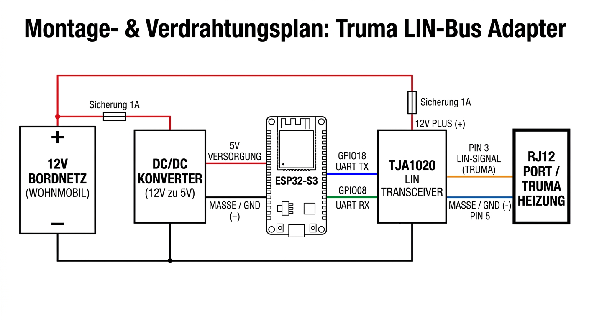

# Hardware Setup: Truma LIN-Bus Adapter

[🇩🇪 Deutsch](README.md) | 🇬🇧 English | [🇫🇷 Français](README.fr.md)

---

## Required Parts

| Component | Model / Note |
|---|---|
| Microcontroller | e.g. Waveshare ESP32-S3-DEV-KIT-N8R8 |
| LIN Transceiver | e.g. TJA1020 module (FST T151) or WomoLIN Board v2 |
| Voltage Regulator | e.g. DC/DC converter 12V → 5V (min. 500 mA) |
| Connector Cable | RJ12 plug (6P6C) for Truma port |
| Wires | Different colors recommended (see color code below) |

---

## Wiring Diagram

---

## All Connections at a Glance

| # | From | To | Voltage |
|---|---|---|---|
| 1 | 12V vehicle supply (+) | DC/DC input (+) | 12V |
| 2 | 12V vehicle supply (−) | DC/DC input (−) | GND |
| 3 | DC/DC output (+) | ESP32-S3 5V pin | 5V |
| 4 | DC/DC output (−) | ESP32-S3 GND pin | GND |
| 5 | ESP32-S3 GPIO18 | TJA1020 TX | 3.3V signal |
| 6 | TJA1020 RX | ESP32-S3 GPIO8 | 3.3V signal |
| 7 | ESP32-S3 GND | TJA1020 GND | GND |
| 8 | 12V vehicle supply (+) | TJA1020 12V input | 12V |
| 9 | TJA1020 LIN | RJ12 Pin 3 | LIN signal |
| 10 | TJA1020 GND | RJ12 Pin 5 | GND |

> **Note:** The TJA1020 requires 12V directly from the vehicle supply (connection #8) —
> not from the 5V output of the DC/DC converter. Use a separate **1A fuse** in this
> 12V line as well. The exact label of the 12V input on the module varies by board type
> (e.g. FST T151 or WomoLIN Board v2).

---

## Installation Order

1. **DC/DC converter** — wire 12V input and 5V output
2. **ESP32-S3** — connect to 5V output of converter
3. **UART TX/RX** — connect between ESP32-S3 and TJA1020
4. **RJ12 cable** — plug into Truma port (power still off)
5. **12V supply** to TJA1020 — last step!

---

## Important Notes

> **Never reverse Plus and Minus** — this will immediately damage the ESP32 and TJA1020.

> **The TJA1020 requires 12V directly from the vehicle supply** — not from the DC/DC converter.

> **Connect everything first, then apply power.**

> **Fuse recommended:** 1A fuse in the 12V positive line, as close to the battery as possible.

---

## ESPHome Configuration

The matching example configurations are available in the repository:
[github.com/havanti/esphome-truma](https://github.com/havanti/esphome-truma)

Choose the appropriate variant for the ESP32-S3:

| Heater | File |
|---|---|
| Truma Combi 4/6 kW gas | [`ESP32-S3_truma_4-6_Gas_example.yaml`](../ESP32-S3_truma_4-6_Gas_example.yaml) |
| Truma Combi 6 kW diesel | [`ESP32-S3_truma_6DE_Diesel_example.yaml`](../ESP32-S3_truma_6DE_Diesel_example.yaml) |

> **Onboard LED (Waveshare ESP32-S3):** The Waveshare ESP32-S3-DEV-KIT-N8R8 has a WS2812 RGB LED on GPIO38. The example YAMLs use it as a status indicator — if wiring and configuration are correct, the LED flashes **green** (CP Plus connected) or **blue** (LIN data being sent).

> **Minimum version:** ESPHome 2026.3.1 or later required.

> **CP Plus vs. iNet Box:** The example YAMLs use `lin_checksum: VERSION_2`
> (for CP Plus). If using an older iNet Box, switch to `VERSION_1` if needed.
