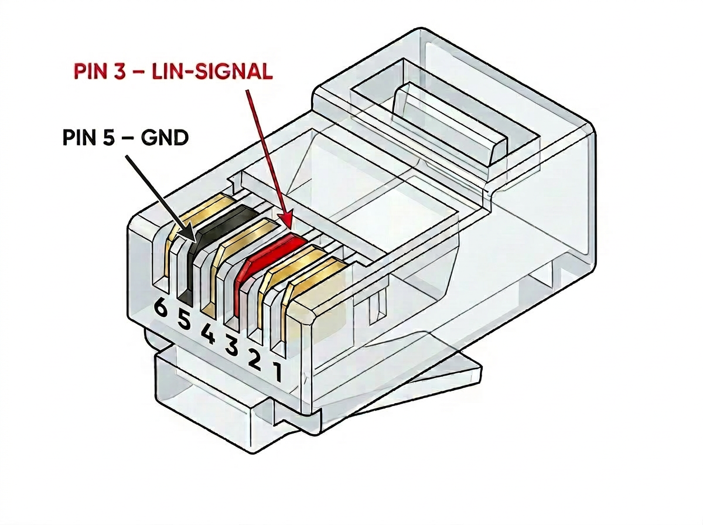

# Hardware Setup: Truma LIN-Bus Adapter

[🇩🇪 Deutsch](README.md) | 🇬🇧 English

This document describes the hardware adapter that connects an ESP32-S3
to a Truma Combi heater via the LIN bus and enables control through
Home Assistant in a motorhome.

---

## Required Parts

| # | Component | Model / Note |
|---|---|---|
| 1 | Microcontroller | e.g. Waveshare ESP32-S3-DEV-KIT-N8R8 |
| 2 | LIN Transceiver | e.g. TJA1020 module (FST T151) or WomoLIN Board v2 |
| 3 | Voltage Regulator | e.g. DC/DC converter 12V → 5V, min. 500 mA |
| 4 | Connection Cable | RJ12 plug, 6-pin (Truma port) |
| 5 | Wires | Stranded ≥ 0.5 mm², different colors recommended |
| 6 | Fuse | 1A blade fuse incl. holder |

---

## Safety Notes

> ⚠️ **Never reverse Plus (+) and Minus (−)** — this immediately and permanently
> damages the ESP32 and LIN transceiver.

> ⚠️ **The LIN transceiver requires 12V directly from the vehicle supply** —
> not from the 5V output of the DC/DC converter.

> ✅ **Connect everything first, then apply power.**

> ✅ **1A fuse** in the 12V positive line, as close to the battery as possible.

---

## Wiring Diagram

---

## Step by Step

### Step 1 — 12V vehicle supply → DC/DC converter

The converter steps the 12V supply down to the 5V required by the ESP32-S3.

| Wire | From | To |
|---|---|---|
| Red | 12V supply (+) | DC/DC input (+) |
| Black | 12V supply (−) | DC/DC input (−) |

> Insert the fuse into the red positive line.

---

### Step 2 — DC/DC converter → ESP32-S3

| Wire | From | To |
|---|---|---|
| Red | DC/DC output (+) | ESP32-S3 **5V pin** |
| Black | DC/DC output (−) | ESP32-S3 **GND pin** |

> Use the **5V pin** — not the 3.3V pin!

---

### Step 3 — ESP32-S3 → LIN transceiver

| Wire | ESP32-S3 | LIN Transceiver |
|---|---|---|
| Green | GPIO18 | TX |
| Green | GPIO8 | RX |
| Black | GND | GND |

> TX and RX from the ESP32 perspective: **TX = transmit**, **RX = receive**.

---

### Step 4 — LIN transceiver → RJ12 (Truma port)

| Wire | From | To |
|---|---|---|
| Orange | TJA1020 LIN | RJ12 **pin 3** |
| Blue | TJA1020 GND | RJ12 **pin 5** |

---

### Step 5 — 12V vehicle supply → LIN transceiver (last!)

| Wire | From | To |
|---|---|---|
| Red | 12V supply (+) | TJA1020 **12V input** |

> Add a second **1A fuse** to the red positive line going to the TJA1020.

> The exact label of the 12V input varies by board type
> (FST T151, WomoLIN Board v2, etc.) — check the datasheet of your module.

---

## All Connections at a Glance

| # | From | To | Voltage |
|---|---|---|---|
| 1 | 12V supply (+) | DC/DC input (+) | 12V |
| 2 | 12V supply (−) | DC/DC input (−) | GND |
| 3 | DC/DC output (+) | ESP32-S3 5V pin | 5V |
| 4 | DC/DC output (−) | ESP32-S3 GND pin | GND |
| 5 | ESP32-S3 GPIO18 | TJA1020 TX | 3.3V |
| 6 | TJA1020 RX | ESP32-S3 GPIO8 | 3.3V |
| 7 | ESP32-S3 GND | TJA1020 GND | GND |
| 8 | 12V supply (+) | TJA1020 12V input | 12V |
| 9 | TJA1020 LIN | RJ12 pin 3 | LIN signal |
| 10 | TJA1020 GND | RJ12 pin 5 | GND |

---

## Before Powering On

- [ ] Plus and Minus correctly wired everywhere?
- [ ] No wire pinched or damaged?
- [ ] RJ12 plug fully seated?
- [ ] Fuse installed?

---

## Troubleshooting

| Problem | Possible Cause | Solution |
|---|---|---|
| ESP32 does not appear on Wi-Fi | Wrong Wi-Fi credentials in firmware | Re-flash firmware with correct credentials |
| No LIN signal | Missing 12V at LIN transceiver | Check connection #8 and fuse |
| ESP32 does not start | No 5V supply | Measure DC/DC converter output voltage |
| Truma does not respond | Wrong RJ12 pin assignment | Verify pin 3 (LIN) and pin 5 (GND) on the RJ12 plug |

---

## ESPHome Configuration

The matching example YAMLs are available in the repository:
**[github.com/havanti/esphome-truma](https://github.com/havanti/esphome-truma)**

Choose the variant matching your ESP32-S3:

| Heater Type | Example File |
|---|---|
| Truma Combi 4/6 kW gas | [`ESP32-S3_truma_4-6_Gas_example.yaml`](../ESP32-S3_truma_4-6_Gas_example.yaml) |
| Truma Combi 6 kW diesel (6DE) | [`ESP32-S3_truma_6DE_Diesel_example.yaml`](../ESP32-S3_truma_6DE_Diesel_example.yaml) |

**Onboard LED (Waveshare ESP32-S3):** The Waveshare ESP32-S3-DEV-KIT-N8R8 has an onboard WS2812 RGB LED on GPIO38. The example YAMLs use it as a status indicator — once wiring and configuration are correct, the LED flashes **green** (CP Plus connected) or **blue** (LIN data being sent).

**Minimum version:** ESPHome 2026.3.1

**CP Plus vs. iNet Box:** The example YAMLs use `lin_checksum: VERSION_2` (for CP Plus).
For an older iNet Box switch to `VERSION_1` if needed.
